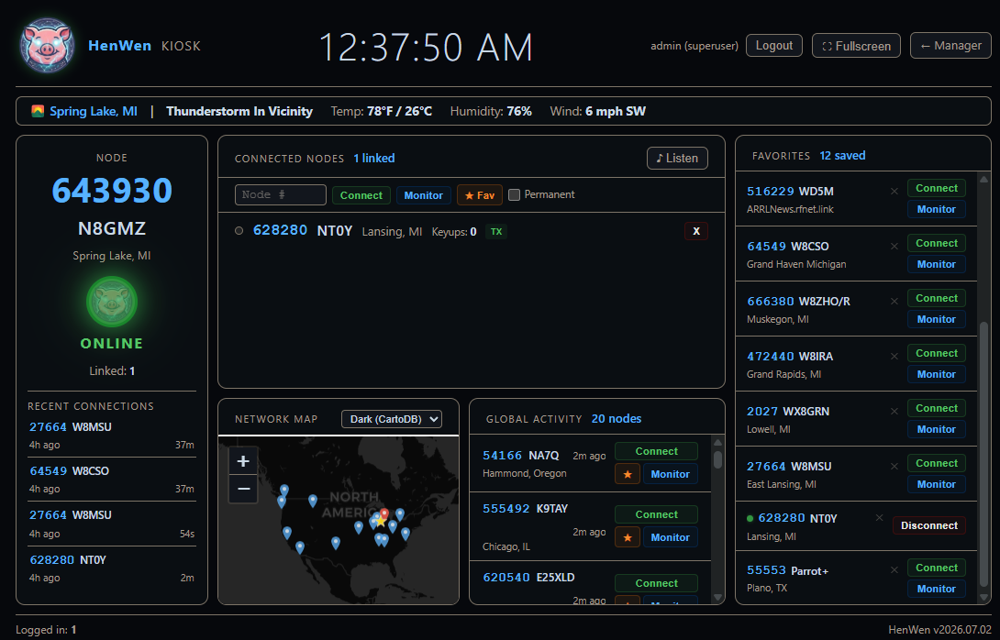
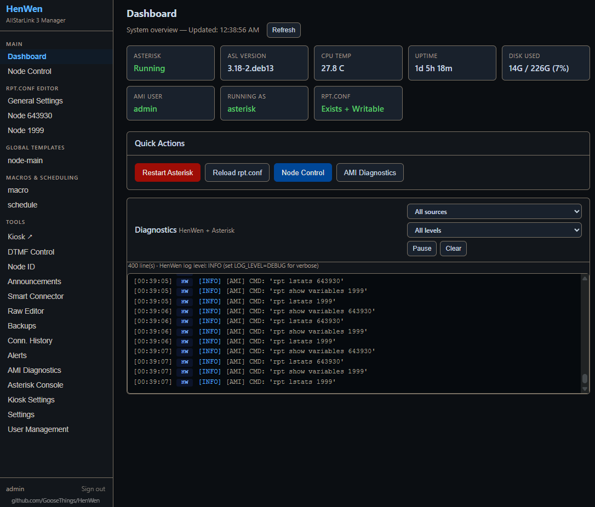

# HenWen — AllStarLink 3 Node Manager & Kiosk

[](https://github.com/GooseThings/HenWen/releases)

A browser-based web interface for managing and using your AllStarLink 3 node. Also supports multiple users via a kiosk. Runs as a systemd service on the same machine as Asterisk.





**Key features:**
- Edit `rpt.conf` field-by-field (validated dropdowns and range-checked inputs sourced from the official ASL3 docs) or switch to a raw text editor
- Connect, disconnect, and **Monitor** (listen-only, `ilink 2`) remote nodes from the browser
- **Stream live receive audio** from your node to any browser tab — WebM/Opus over HTTP, multiple simultaneous listeners
- **Status Board** (`/status`) — full-screen kiosk display for TVs and public screens: connected nodes, global activity feed, network map with grayline, weather bar
- **Smart Connector** — automatically link to a net node on a schedule (daily, weekly, monthly, one-time, and more), wait for the local node to go idle before connecting, then disconnect after an idle timeout
- **Announcements** — upload audio files, or type a message and have it read aloud via text-to-speech, and schedule either to play on a node at configured times
- **Weather Alerts** — automatically play Tornado/Severe Thunderstorm/Flash Flood alerts from the National Weather Service on your node, repeating at an interval for as long as they stay active, no manual action needed once configured
- **Node ID** — FCC-compliant background ID monitor: plays a sound file on key-up, on interval during continuous activity, and after the node goes idle
- **Multi-user accounts** — Superuser, Admin, and User (Kiosk) roles; kiosk accounts can connect/disconnect nodes but cannot access settings
- **Asterisk Console** — live log viewer, CLI command runner, and verbosity control, all from the browser
- Automatic `rpt.conf` backups on every save
- Dashboard with system vitals, AMI diagnostics, and a Reload/Restart Asterisk button
- 12 color themes, mobile-responsive layout

---

## Requirements

- AllStarLink 3 on **Debian 12 (Bookworm)** or **Debian 13 (Trixie)**
- Asterisk already installed and running (`systemctl status asterisk`)
- Python 3.8 or later
- Root access (required to write `/etc/asterisk/rpt.conf` and restart Asterisk)
- `ffmpeg` — required only if you use the Announcements or Node ID audio upload features (`sudo apt install ffmpeg`)
- `piper-tts` — required only for the text-to-speech Announcements feature; installed automatically into the venv by `install.sh`/`requirements.txt`, unlike `ffmpeg` there's no separate apt step. On an existing install being upgraded in place, re-run `venv/bin/pip install -r requirements.txt` to pick it up (a HenWen restart alone won't).

---

## Step 1 — Install

```bash
git clone https://github.com/GooseThings/HenWen.git
cd HenWen
sudo bash install.sh
```

The installer:
- Installs Python dependencies into a virtual environment
- Creates and enables the `HenWen` systemd service (runs on port 5000)
- Starts the service immediately

Verify it is running:

```bash
systemctl status HenWen
```

---

## Step 2 — First Launch: Create Your Account

Open a browser and go to:

```
http://YOUR_NODE_IP:5000
```

The first time you visit, you will be prompted to create the **initial Superuser account**. This account has full access to everything. Set a strong password — it is stored as a salted hash and cannot be recovered if lost.

After creating the account you will be logged in and taken to the Dashboard.

> **Tip:** You can add more accounts later under **Manager → User Management**. Use **Admin** for operators who need full access but not raw config editing. Use **User (Kiosk)** for accounts that can only connect and disconnect nodes.

---

## Step 3 — Commission: AMI Setup

Most features (node connect/disconnect, monitor, status board, smart connector, audio streaming, node ID) require a working AMI connection. This is set up once.

### 3a — Configure manager.conf

Edit `/etc/asterisk/manager.conf`:

```ini
[general]
enabled = yes
port = 5038
bindaddr = 127.0.0.1

[henwen]
secret = your_secret_here
read  = system,call,log,verbose,command,agent,user,config,dtmf,reporting,cdr,dialplan
write = system,call,log,verbose,command,agent,user,config,dtmf,reporting,cdr,dialplan
permit = 127.0.0.1/255.255.255.0
```

> The stanza name (`henwen` above) becomes your `AMI_USER`. Choose any name and secret you like.

Reload Asterisk to apply:

```bash
sudo asterisk -rx "module reload manager"
```

### 3b — Add credentials to the service file

```bash
sudo nano /etc/systemd/system/HenWen.service
```

Set these two lines to match what you put in `manager.conf`:

```
Environment="AMI_USER=henwen"
Environment="AMI_SECRET=your_secret_here"
```

Apply and restart:

```bash
sudo systemctl daemon-reload
sudo systemctl restart HenWen
```

### 3c — Verify

In the web UI, go to **Dashboard → AMI Diagnostics** and click **Run Test**. All checks should show green. If any fail, the output includes an exact fix instruction.

---

## Step 4 — Commission: Rotate the Secret Key

HenWen ships with a default `SECRET_KEY` that signs session cookies. You should replace it before putting the system into service.

Go to **Settings** in the web UI and click **Generate & Apply New Key** (or type your own, 16+ characters). This writes the new key to the service file and restarts the service. The Dashboard shows a warning banner until the key has been rotated.

---

## Step 5 — Verify Your rpt.conf

Go to **Manager** in the web UI. Your node stanzas from `/etc/asterisk/rpt.conf` will be listed in the sidebar. Click any node to see and edit its settings.

- Use **Reload rpt.conf** on the Dashboard after saving changes (runs `rpt restart` — no full Asterisk restart needed).
- Use **Restart Asterisk** for changes that require a full restart.

---

## Updating HenWen

HenWen's code installs to `/opt/HenWen`, while your configuration and data live elsewhere and are **not** touched by a code update:

- AMI credentials and `SECRET_KEY` — `/etc/systemd/system/HenWen.service`
- Users, favorites, connectors, announcements — `/etc/asterisk/henwen.db`
- rpt.conf backups — `/etc/asterisk/rpt_backups/`

The SQLite schema migrates automatically on startup, so new features need no manual database steps.

### Quick update (recommended)

Pulls the latest code and restarts the service. Your service file, database, and backups are all preserved. See [Releases](https://github.com/GooseThings/HenWen/releases) or [CHANGELOG.md](CHANGELOG.md) for what's new.

```bash
cd ~/HenWen          # the directory you originally cloned into
git pull
sudo cp -r app.py templates static /opt/HenWen/
sudo systemctl restart HenWen
```

If a release adds new Python dependencies (check `requirements.txt`), also refresh the virtual environment:

```bash
sudo /opt/HenWen/venv/bin/pip install -r /opt/HenWen/requirements.txt
sudo systemctl restart HenWen
```

### Full reinstall

Re-running the installer also refreshes Python dependencies and the systemd unit. **It overwrites the service file** (`/etc/systemd/system/HenWen.service`) with the default template and re-runs AMI setup — so back up your service file first and restore it afterward, or you will lose your AMI credentials and `SECRET_KEY`:

```bash
cd ~/HenWen
git pull
sudo cp /etc/systemd/system/HenWen.service ~/HenWen.service.bak   # save your credentials
sudo bash install.sh
sudo cp ~/HenWen.service.bak /etc/systemd/system/HenWen.service   # restore them
sudo systemctl daemon-reload && sudo systemctl restart HenWen
```

### Verify

```bash
systemctl status HenWen
```

Then open the web UI and run **Dashboard → AMI Diagnostics → Run Test**. Hard-refresh the browser (Ctrl-Shift-R) to pick up any updated UI.

---

## Using the Status Board

The Status Board at `/status` (or **Status Board ↗** in the sidebar) is designed for TV or kiosk display. It requires no login to view.

Features: live node status, connected node list, global activity feed, network map with grayline, and a weather bar.

Admin and Superuser accounts can connect/disconnect nodes directly from the Status Board. Kiosk (User) accounts see a login prompt and are limited to one active connection at a time.

The footer shows how many users are currently logged in across the app. The **Manager** link in the header opens the manager in a new tab, so the kiosk display keeps running undisturbed.

To set it up on a dedicated display, open `http://YOUR_NODE_IP:5000/status` in a browser and press F11 for fullscreen. Configure the map, themes, and pin duration under **Manager → Kiosk Settings**.

---

## Multi-User Accounts

Manage accounts under **Manager → User Management**.

| Role | Access |
|------|--------|
| **Superuser** | Full access including raw `rpt.conf` editor |
| **Admin** | Full access except raw editor |
| **User (Kiosk)** | Connect/disconnect nodes only; no settings |

Kiosk accounts can be given a **Favorites** list of pre-configured nodes to connect to quickly from the Status Board.

---

## Smart Connector (Auto Connector)

Found under **Manager → Smart Connector**.

Automatically links to a remote node on a schedule, waits for the local node to go idle before connecting, observes a settle period, then disconnects after a configurable idle timeout.

**Schedule types:** Manual only, Daily, Weekly (choose days), Bi-Weekly, Monthly, Every 2 Months, Quarterly, Yearly, One-Time (auto-disables after firing).

Before enabling a connector, run the **Pre-flight Diagnostics** in the same section to verify all AMI paths work correctly.

---

## Announcements

Found under **Manager → Announcements**. Available to Admin and Superuser accounts.

Upload an audio file (mp3, wav, ogg, flac, m4a), or type a message and have it converted to speech — either way, schedule it to play on a node. Files are converted to 8 kHz mono ULAW automatically via `ffmpeg`. Each announcement has a time window, repeat interval, idle-settle period (waits for the node to be quiet before playing), and local-only vs all-links playback mode.

**Text-to-speech**: pick "Type Text" instead of "Upload File", choose a voice, and write the message (800 characters max). A voice must be downloaded once before it can be used — the picker shows which voices are already available and lets you fetch a new one (roughly 60-115MB per voice, from the [Piper voices](https://huggingface.co/rhasspy/piper-voices) project). Use the Preview button to hear a message on the node before saving it as a scheduled announcement. Editing a TTS announcement's text re-synthesizes the audio in place.

---

## Weather Alerts

Found under **Manager → Weather Alerts**. Available to Admin and Superuser accounts.

Polls the National Weather Service every couple of minutes for active Tornado Warnings, Severe Thunderstorm Warnings, and similar severe weather products for a configured county/zone, and automatically creates and schedules a TTS announcement for each one that's currently active — no manual action needed. Announcements disappear on their own once NWS shows the alert has ended, or can be removed manually from the Currently Active list (if the alert is still active in NWS's feed, it may reappear on the next check).

Click **Detect Zone** to auto-fill the zone from your node's configured location, or enter an NWS UGC code manually. Pick which alert types to watch (Tornado Warning and Severe Thunderstorm Warning are on by default), a node, playback mode, voice, and how often an active alert repeats. Unlike routine Announcements, these ignore the quiet-hours window entirely and have a "max defer" setting that can force playback even if the channel hasn't gone idle, so a real warning isn't silently delayed for too long. Use **Send Test Alert** to verify the whole pipeline without waiting for real weather.

---

## Node ID

Found under **Manager → Node ID**.

Plays a configurable sound file for FCC-required station identification. Triggers on initial key-up (optional), every N seconds of continuous activity, and M seconds after the node goes idle. Monitors multiple nodes simultaneously.

---

## Troubleshooting

**Service won't start:**
```bash
journalctl -u HenWen -n 50
systemctl status HenWen
```

**Can't reach the web UI:**
- Confirm the service is running: `systemctl status HenWen`
- Check that port 5000 is not blocked by a firewall: `ss -tlnp | grep 5000`
- Try `http://127.0.0.1:5000` directly on the node

**Permission denied saving rpt.conf:**
- The service runs as the `asterisk` user, which must be able to write `rpt.conf`. Check: `grep User= /etc/systemd/system/HenWen.service` — should say `User=asterisk`, and confirm that user has write access to `/etc/asterisk/rpt.conf`.

**rpt.conf changes don't take effect:**
- Click **Reload rpt.conf** on the Dashboard after saving. If that doesn't help, use **Restart Asterisk**.

**AMI login failed:**
- Confirm `AMI_USER` and `AMI_SECRET` in the service file exactly match the stanza name and secret in `manager.conf`.
- Verify `enabled = yes` in `[general]` of `manager.conf`.
- Confirm the AMI user stanza has `write` permissions including `command`.
- Check Asterisk is running: `systemctl status asterisk`
- Run the AMI Diagnostics test in the Dashboard for a step-by-step report.

**Node connect/disconnect has no effect:**
- Confirm AMI test passes first.
- Verify your node number appears in the local node dropdown (it must be in `rpt.conf`).
- Check the rpt.conf has a valid `[NODENUMBER]` stanza with a `rxchannel` configured.

**Asterisk restart fails from the UI:**
- Service must run as root.
- Verify Asterisk is managed by systemd: `systemctl status asterisk`

**Audio streaming (Listen) produces no sound:**
- Requires an active Asterisk channel on the node. The node must be keyed or have an active link.
- Check that `app_mixmonitor.so` is loaded: `asterisk -rx "module show like mixmonitor"`

**Announcements or Node ID audio won't upload:**
- Confirm `ffmpeg` is installed: `ffmpeg -version`
- Install if missing: `sudo apt install ffmpeg`

**Text-to-speech announcements fail with "piper: command not found" or similar:**
- An in-place upgrade needs its own pip step — a HenWen restart alone doesn't install new Python dependencies. Run `sudo -u asterisk venv/bin/pip install -r requirements.txt` from `/opt/HenWen`, then restart the service.
- Confirm it resolved correctly: `sudo -u asterisk /opt/HenWen/venv/bin/piper --help`

---

## Environment Variables

All settings are configured in the systemd service file (`/etc/systemd/system/HenWen.service`). After editing, run `sudo systemctl daemon-reload && sudo systemctl restart HenWen`.

| Variable | Default | Description |
|----------|---------|-------------|
| `AMI_USER` | *(none)* | AMI username — must match `manager.conf` stanza name |
| `AMI_SECRET` | *(none)* | AMI password — must match `manager.conf` secret |
| `AMI_HOST` | `127.0.0.1` | Asterisk host |
| `AMI_PORT` | `5038` | AMI TCP port |
| `RPT_CONF_PATH` | `/etc/asterisk/rpt.conf` | Path to rpt.conf |
| `MANAGER_CONF` | `/etc/asterisk/manager.conf` | Path to manager.conf |
| `BACKUP_DIR` | `/etc/asterisk/rpt_backups` | Backup directory for rpt.conf saves |
| `DB_PATH` | `/etc/asterisk/henwen.db` | SQLite database (users, favorites, connectors, etc.) |
| `SOUNDS_DIR` | `/usr/share/asterisk/sounds/henwen` | Uploaded audio files for Announcements and Node ID |
| `TTS_VOICES_DIR` | `/var/lib/asterisk/henwen_tts_voices` | Downloaded Piper voice models for text-to-speech Announcements |
| `PIPER_BIN` | *(resolved from the venv automatically)* | Path to the `piper` executable, if it needs to be overridden |
| `PORT` | `5000` | Web server port |
| `HOST` | `0.0.0.0` | Bind address |
| `SECRET_KEY` | `henwen-change-me` | Flask session key — rotate via the Settings page |
| `SERVICE_NAME` | `HenWen` | systemd unit name (used when applying a new SECRET_KEY) |
| `SERVICE_FILE_PATH` | `/etc/systemd/system/<SERVICE_NAME>.service` | Path to the unit file the Settings page edits |
| `LOG_LEVEL` | `INFO` | HenWen log verbosity: `INFO` or `DEBUG` (full trace in journald) |
| `ASTERISK_LOG_PATH` | `/var/log/asterisk/messages.log` | Asterisk log shown in the Asterisk Console page |

---

## File Structure

```
HenWen/
├── app.py                      # Flask backend — all routes, AMI, scheduler threads
├── templates/
│   ├── index.html              # Manager shell (nav + page loader)
│   ├── henwen-manager.html     # All manager pages (settings, connectors, users, etc.)
│   ├── login.html              # Login / first-run account creation
│   └── status.html             # Status Board / kiosk display (/status)
├── requirements.txt            # Python dependencies (flask, gunicorn, werkzeug)
├── HenWen.service             # systemd unit file template
├── install.sh                  # Installer
├── uninstall.sh                # Uninstaller
├── README.md
└── CHANGELOG.md
```

---

## License

GPL-3.0 — use at your own risk. Not affiliated with AllStarLink, Inc.

*73 de N8GMZ dit dit*
