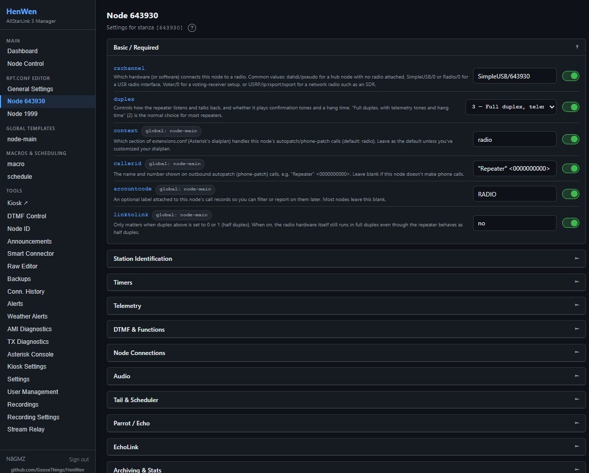

# HenWen — AllStarLink 3 Node Manager & Kiosk

[](https://github.com/GooseThings/HenWen/releases)
[](https://github.com/GooseThings/HenWen/wiki)

A browser-based web interface for managing and using your AllStarLink 3 node, with a public kiosk display for shared spaces. Runs as a systemd service on the same machine as Asterisk — no separate server required.




## Highlights

- **Node management** — edit `rpt.conf` field-by-field or raw, connect/disconnect/monitor nodes from the browser, and schedule automatic links with Smart Connector
- **Audio** — listen live from any browser tab, transmit back with no radio, record on demand, relay to Broadcastify/YouTube Live, and schedule announcements (upload or text-to-speech)
- **Weather Alerts** — auto-plays NWS Tornado/Severe Thunderstorm/Flash Flood warnings on your node the moment they go active
- **Status Board** — a full-screen kiosk display for TVs and public screens, no login required to view, with a live network map (grayline, radar, APRS, ISS passes)
- **Multi-user accounts** with role-based access (Owner/Superuser/Admin/Kiosk), plus a live Asterisk console and system dashboard

Full feature tour → **[HenWen Wiki](https://github.com/GooseThings/HenWen/wiki)**

## Requirements

AllStarLink 3 on Debian 12/13, Python 3.8+, root access, and `ffmpeg`. A Raspberry Pi Zero 2 W is a reasonable minimum for everything except the Stream Relay's YouTube target — see [Installation → Requirements](https://github.com/GooseThings/HenWen/wiki/Installation#requirements) for the full breakdown.

## Install

```bash
git clone https://github.com/GooseThings/HenWen.git
cd HenWen
sudo bash install.sh
```

Then open `http://YOUR_NODE_IP:5000` to create your Owner account. The installer runs AMI setup for you interactively — full walkthrough (AMI setup, rotating the secret key, verifying rpt.conf, updating) is in the **[Installation guide](https://github.com/GooseThings/HenWen/wiki/Installation)**.

## Documentation

Everything beyond a quick install lives in the **[wiki](https://github.com/GooseThings/HenWen/wiki)**:

- [Installation](https://github.com/GooseThings/HenWen/wiki/Installation) — requirements, setup steps, updating
- [Status Board & Accounts](https://github.com/GooseThings/HenWen/wiki/Status-Board-and-Accounts) — kiosk display, roles, node lockout
- [Features](https://github.com/GooseThings/HenWen/wiki/Features) — Smart Connector, Announcements, Weather Alerts, Node ID, Audio Recording, Stream Relay, Browser TX
- [Troubleshooting](https://github.com/GooseThings/HenWen/wiki/Troubleshooting)
- [Environment Variables & File Structure](https://github.com/GooseThings/HenWen/wiki/Reference)

## Contributing & Feedback

Bug reports, feature requests, and pull requests are welcome — open an [issue](https://github.com/GooseThings/HenWen/issues) or check [open-issues.md](open-issues.md) for a running log of known items. See [CHANGELOG.md](CHANGELOG.md) for release history.

## License

GPL-3.0 — use at your own risk. Not affiliated with AllStarLink, Inc.

*73 de N8GMZ dit dit*
