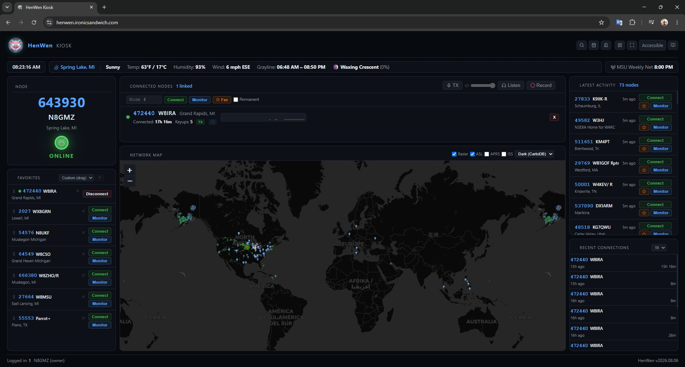

# HenWen — AllStarLink 3 Node Manager & Kiosk

[](https://github.com/GooseThings/HenWen/releases)

A browser-based web interface for managing and using your AllStarLink 3 node. Also supports multiple users via a kiosk. Runs as a systemd service on the same machine as Asterisk.




**Key features:**

**Node management**
- Edit `rpt.conf` field-by-field (validated dropdowns and range-checked inputs sourced from the official ASL3 docs) or switch to a raw text editor
- Connect, disconnect, and **Monitor** (listen-only, `ilink 2`) remote nodes from the browser
- **Smart Connector** — automatically link to a net node on a schedule (daily, weekly, monthly, one-time, and more), wait for the local node to go idle before connecting, then disconnect after an idle timeout
- Automatic `rpt.conf` backups on every save

**Audio**
- **Stream live receive audio** from your node to any browser tab — WebM/Opus over HTTP, multiple simultaneous listeners
- **Transmit from the browser** — any logged-in account can key up and talk through the node with no radio, straight from the Kiosk (requires one-time HTTPS + Asterisk setup, see [Browser TX](#browser-tx-transmit) below)
- **Record live audio on demand** — silence-trimmed, with a periodic spoken timestamp, configurable storage caps/retention, and an automatic browser download when you stop (see [Audio Recording](#audio-recording) below)
- **Relay live audio to Broadcastify and/or YouTube Live**, continuously and independent of any listener or recording session — the YouTube feed includes a live waveform video with a station/clock/weather text overlay (see [Stream Relay](#stream-relay) below)
- **Announcements** — upload audio files, or type a message and have it read aloud via text-to-speech, and schedule either to play on a node at configured times
- **Weather Alerts** — automatically play Tornado/Severe Thunderstorm/Flash Flood alerts from the National Weather Service on your node, repeating at an interval for as long as they stay active, no manual action needed once configured
- **Node ID** — FCC-compliant background ID monitor: plays a sound file on key-up, on interval during continuous activity, and after the node goes idle

**Status Board (kiosk display)**
- Full-screen display for TVs and public screens at `/status` — no login required to view
- Network map with grayline (day/night terminator), sunrise/sunset times and moon phase, and optional NEXRAD radar, APRS-IS station, and ISS pass-tracking overlays
- Fully customizable panel layout on desktop — drag, resize, collapse, or hide any panel; saved per browser
- Connected-nodes list with a per-connection keyed-activity timeline, a global network activity feed, and a weather bar

**Administration**
- **Multi-user accounts** — Owner, Superuser, Admin, and User (Kiosk) roles; kiosk accounts can connect/disconnect nodes but cannot access settings; an Owner can lock a node to put everyone else in read-only mode
- **Asterisk Console** — live log viewer, CLI command runner, and verbosity control, all from the browser
- Dashboard with system vitals, AMI diagnostics, and a Reload/Restart Asterisk button
- 12 color themes, mobile-responsive layout

**Setup:** [Requirements](#requirements) · [Install](#step-1--install) · [Create account](#step-2--first-launch-create-your-account) · [AMI setup](#step-3--commission-ami-setup) · [Secret key](#step-4--commission-rotate-the-secret-key) · [Verify rpt.conf](#step-5--verify-your-rptconf) · [Updating](#updating-henwen)

**Using HenWen:** [Status Board](#using-the-status-board) · [Accounts](#multi-user-accounts) · [Smart Connector](#smart-connector-auto-connector) · [Announcements](#announcements) · [Weather Alerts](#weather-alerts) · [Node ID](#node-id) · [Audio Recording](#audio-recording) · [Stream Relay](#stream-relay) · [Browser TX](#browser-tx-transmit)

**Reference:** [Troubleshooting](#troubleshooting) · [Environment Variables](#environment-variables) · [File Structure](#file-structure)

---

## Requirements

- AllStarLink 3 on **Debian 12 (Bookworm)** or **Debian 13 (Trixie)**
- Asterisk already installed and running (`systemctl status asterisk`)
- Python 3.8 or later
- Root access (required to write `/etc/asterisk/rpt.conf` and restart Asterisk)
- `ffmpeg` — required for Announcements/Node ID audio uploads, live audio streaming/recording, and the Stream Relay feature (`sudo apt install ffmpeg`)
- `piper-tts` — required only for the text-to-speech Announcements feature; installed automatically into the venv by `install.sh`/`requirements.txt`, unlike `ffmpeg` there's no separate apt step. On an existing install being upgraded in place, re-run `venv/bin/pip install -r requirements.txt` to pick it up (a HenWen restart alone won't).

**Hardware:** a Raspberry Pi Zero 2 W (quad-core, has NEON) is a reasonable minimum for everything in HenWen — **except the Stream Relay's YouTube target**, which encodes a live video overlay and is genuinely CPU-heavy; a Raspberry Pi 4 (4GB+) or better is recommended if you plan to use that specific feature. The Broadcastify relay target is audio-only and stays light on any hardware. The original Pi Zero/Zero W (no NEON) is not sufficient for real-time audio streaming or recording at all, regardless of which features you use.

---

## Step 1 — Install

Note: If you have a minimalistic debian install you'll need to update, upgrade, and then install sudo first, as root:

```bash
su -
apt update
apt upgrade
apt install sudo
```
Then install HenWen:
```bash
git clone https://github.com/GooseThings/HenWen.git
cd HenWen
sudo bash install.sh
```

The installer:
- Installs Python dependencies into a virtual environment
- Checks that Asterisk's `app_mixmonitor.so` module is loaded (needed for the Listen feature)
- Creates and enables the `HenWen` systemd service (runs on port 5000), plus the sudoers rule and journald log cap the Manager UI's restart/update buttons need
- Starts the service, then runs AMI setup (see Step 3) and offers to set up HTTPS for the Browser TX button (see [Browser TX](#browser-tx-transmit)) interactively

Verify it is running:

```bash
systemctl status HenWen
```

---

## Step 2 — First Launch: Create Your Account

Open a browser and go to:

```
http://YOUR_NODE_IP:5000
```

The first time you visit, you will be prompted to create the **initial Owner account**. This account has full access to everything, plus exclusive Node Lockout control. Set a strong password — it is stored as a salted hash and cannot be recovered if lost.

After creating the account you will be logged in and taken to the Dashboard.

> **Tip:** You can add more accounts later under **Manager → User Management**. Use **Admin** for operators who need full access but not raw config editing. Use **User (Kiosk)** for accounts that can only connect and disconnect nodes.

---

## Step 3 — Commission: AMI Setup

Most features (node connect/disconnect, monitor, status board, smart connector, audio streaming, recording, stream relay, node ID) require a working AMI connection. This is set up once.

> `install.sh` already ran `ami-setup.sh` for you interactively at the end of Step 1 — if that succeeded, you can skip straight to **3c — Verify** below. Use the steps below if you skipped it, it failed, or you need to redo it manually.

### 3a — Configure manager.conf

Edit `/etc/asterisk/manager.conf`:

```ini
[general]
enabled = yes
port = 5038
bindaddr = 127.0.0.1

[henwen]
secret = your_secret_here
read  = system,call,log,verbose,command,agent,user,config,dtmf,reporting,cdr,dialplan
write = system,call,log,verbose,command,agent,user,config,dtmf,reporting,cdr,dialplan
permit = 127.0.0.1/255.255.255.0
```

> The stanza name (`henwen` above) becomes your `AMI_USER`. Choose any name and secret you like.

Reload Asterisk to apply:

```bash
sudo asterisk -rx "module reload manager"
```

### 3b — Add credentials to the service file

```bash
sudo nano /etc/systemd/system/HenWen.service
```

Set these two lines to match what you put in `manager.conf`:

```
Environment="AMI_USER=henwen"
Environment="AMI_SECRET=your_secret_here"
```

Apply and restart:

```bash
sudo systemctl daemon-reload
sudo systemctl restart HenWen
```

### 3c — Verify

In the web UI, go to **Dashboard → AMI Diagnostics** and click **Run Test**. All checks should show green. If any fail, the output includes an exact fix instruction.

---

## Step 4 — Commission: Rotate the Secret Key

HenWen ships with a default `SECRET_KEY` that signs session cookies. You should replace it before putting the system into service.

Go to **Settings** in the web UI and click **Generate & Apply New Key** (or type your own, 16+ characters). This writes the new key to the service file and restarts the service. The Dashboard shows a warning banner until the key has been rotated.

The same page's **Network Ports** card (superuser only) lets you change the web UI's own port and the AMI port without hand-editing the service file — useful if either default collides with something else already running on the box. Changing the AMI port also updates `manager.conf` to match automatically. Changing the web UI port disconnects the current page without reloading it, since the URL itself changes — you'll need to navigate to the new port by hand afterward.

---

## Step 5 — Verify Your rpt.conf

Go to **Manager** in the web UI. Your node stanzas from `/etc/asterisk/rpt.conf` will be listed in the sidebar. Click any node to see and edit its settings.

- Use **Reload rpt.conf** on the Dashboard after saving changes (runs `rpt restart` — no full Asterisk restart needed).
- Use **Restart Asterisk** for changes that require a full restart.

---

## Updating HenWen

HenWen's code installs to `/opt/HenWen`, while your configuration and data live elsewhere and are **not** touched by a code update:

- AMI credentials and `SECRET_KEY` — `/etc/systemd/system/HenWen.service`
- Users, favorites, connectors, announcements, recording/stream relay settings — `/etc/asterisk/henwen.db`
- rpt.conf backups — `/etc/asterisk/rpt_backups/`
- Saved audio recordings — `/var/lib/asterisk/henwen_recordings/` (see [`RECORDINGS_DIR`](#environment-variables))

The SQLite schema migrates automatically on startup, so new features need no manual database steps.

### In-app update (easiest)

Superusers see a dismissible bar at the top of the Manager when a new release is available (checked once a day against GitHub). Click **Launch Updater** to pull `main`, reinstall Python dependencies, and restart — no SSH needed. It runs as its own systemd unit so its own restart step can't kill itself mid-update, and it verifies the new code actually compiles before touching the running service, rolling back automatically if it doesn't. Only works if `/opt/HenWen` is a git checkout (true for anything installed via `install.sh`'s documented `git clone` step); it does not touch system config (Apache/HTTPS, sudoers, journald), same as Quick update below.

### Quick update (recommended)

Pulls the latest code and restarts the service. Your service file, database, and backups are all preserved. See [Releases](https://github.com/GooseThings/HenWen/releases) or [CHANGELOG.md](CHANGELOG.md) for what's new.

```bash
cd ~/HenWen          # the directory you originally cloned into
git pull
sudo cp -r app.py audio_relay.py recording.py stream_relay.py templates static tx-spike /opt/HenWen/
sudo systemctl restart HenWen
```

If a release adds new Python dependencies (check `requirements.txt`), also refresh the virtual environment:

```bash
sudo /opt/HenWen/venv/bin/pip install -r /opt/HenWen/requirements.txt
sudo systemctl restart HenWen
```

Installer-driven system changes (Apache/HTTPS for the TX button, the MixMonitor module check, sudoers rules, the journald cap) only run from `install.sh` itself — neither this quick-update path nor the in-app "Launch Updater" self-update button touches system config, by design, since an unattended updater must never silently open ports or request a public certificate. If you're upgrading an existing install and want the browser TX button's HTTPS set up, run it directly: `sudo bash /opt/HenWen/tx-spike/setup-https.sh <hostname> <email>`.

### Full reinstall

Re-running the installer also refreshes Python dependencies and the systemd unit. **It overwrites the service file** (`/etc/systemd/system/HenWen.service`) with the default template and re-runs AMI setup — so back up your service file first and restore it afterward, or you will lose your AMI credentials and `SECRET_KEY`:

```bash
cd ~/HenWen
git pull
sudo cp /etc/systemd/system/HenWen.service ~/HenWen.service.bak   # save your credentials
sudo bash install.sh
sudo cp ~/HenWen.service.bak /etc/systemd/system/HenWen.service   # restore them
sudo systemctl daemon-reload && sudo systemctl restart HenWen
```

### Verify

```bash
systemctl status HenWen
```

Then open the web UI and run **Dashboard → AMI Diagnostics → Run Test**. Hard-refresh the browser (Ctrl-Shift-R) to pick up any updated UI.

---

## Using the Status Board

The Status Board at `/status` (or **Status Board ↗** in the sidebar) is designed for TV or kiosk display. It requires no login to view.

Features: live node status, connected node list with a per-connection keyed-activity timeline, global activity feed, a weather bar with grayline (day/night terminator) and moon phase, and a network map with optional NEXRAD radar, APRS-IS station, and ISS pass-tracking overlays.

- **APRS** needs a licensed amateur's own callsign saved once under **Manager → Kiosk Settings** — the layer stays off until one is set, and `aprslib` (installed automatically) must be present.
- **ISS** and **Radar** need no setup — just toggle them on from the map.

On desktop, the whole panel layout (Node, Recent Connections, Connected Nodes, Network Map, Latest Activity, Favorites) can be dragged into any arrangement, resized, collapsed, or hidden via the layout-edit toggle in the Node panel's toolbar — saved per browser. Mobile keeps a fixed stacked layout.

Owner, Superuser, and Admin accounts can connect/disconnect nodes directly from the Status Board. Kiosk (User) accounts see a login prompt and are limited to one active connection at a time; an individual User account can also be marked **Restrict disconnect** in User Management, letting it listen, TX, and make the first connection but never disconnect one.

The footer shows how many users are currently logged in across the app. The **Manager** link in the header opens the manager in a new tab, so the kiosk display keeps running undisturbed.

To set it up on a dedicated display, open `http://YOUR_NODE_IP:5000/status` in a browser and press F11 for fullscreen. Configure the map, themes, and pin duration under **Manager → Kiosk Settings**.

---

## Multi-User Accounts

Manage accounts under **Manager → User Management**.

| Role | Access |
|------|--------|
| **Owner** | Everything a Superuser has, plus **Node Lockout** — can lock a node to put the whole system read-only for every other role, itself exempt |
| **Superuser** | Full access including raw `rpt.conf` editor |
| **Admin** | Full access except raw editor |
| **User (Kiosk)** | Connect/disconnect nodes, listen, and TX; no settings. Can optionally be marked **Restrict disconnect** (below) |

Kiosk accounts can be given a **Favorites** list of pre-configured nodes to connect to quickly from the Status Board.

Any User account can also be checked **Restrict disconnect** in User Management — it can still listen, TX, and make the first connection when nothing else is connected, but it can never disconnect a node (the kiosk shows a locked disconnect button instead). This is enforced server-side, live against the account's current setting, not cached in the session.

Any account, including the owner's own, needs **Can record** checked in User Management before the Record button appears for it — see [Audio Recording](#audio-recording) above.

### Node Lockout

Under **Manager → Node Control → Node Lockout**, an Owner account can lock any locally-hosted node. While any node is locked, every other role — Admin and Superuser included — is limited to read-only access system-wide (viewing pages still works; anything that changes state, including kiosk connect/disconnect, is refused with a "Locked by the node owner" error) until an Owner unlocks it. The Status Board's Node card shows a **LOCKED** badge whenever the node is in this state.

---

## Smart Connector (Auto Connector)

Found under **Manager → Smart Connector**.

Automatically links to a remote node on a schedule, waits for the local node to go idle before connecting, observes a settle period, then disconnects after a configurable idle timeout.

**Schedule types:** Manual only, Daily, Weekly (choose days), Bi-Weekly, Monthly, Every 2 Months, Quarterly, Yearly, One-Time (auto-disables after firing).

Before enabling a connector, run the **Pre-flight Diagnostics** in the same section to verify all AMI paths work correctly.

---

## Announcements

Found under **Manager → Announcements**. Available to Admin and Superuser accounts.

Upload an audio file (mp3, wav, ogg, flac, m4a), or type a message and have it converted to speech — either way, schedule it to play on a node. Files are converted to 8 kHz mono ULAW automatically via `ffmpeg`. Each announcement has a time window, repeat interval, idle-settle period (waits for the node to be quiet before playing), and local-only vs all-links playback mode.

**Text-to-speech**: pick "Type Text" instead of "Upload File", choose a voice, and write the message (800 characters max). A voice must be downloaded once before it can be used — the picker shows which voices are already available and lets you fetch a new one (roughly 60-115MB per voice, from the [Piper voices](https://huggingface.co/rhasspy/piper-voices) project). Use the Preview button to hear a message on the node before saving it as a scheduled announcement. Editing a TTS announcement's text re-synthesizes the audio in place.

---

## Weather Alerts

Found under **Manager → Weather Alerts**. Available to Admin and Superuser accounts.

Polls the National Weather Service every couple of minutes for active Tornado Warnings, Severe Thunderstorm Warnings, and similar severe weather products for a configured county/zone, and automatically creates and schedules a TTS announcement for each one that's currently active — no manual action needed. Announcements disappear on their own once NWS shows the alert has ended, or can be removed manually from the Currently Active list (if the alert is still active in NWS's feed, it may reappear on the next check).

Click **Detect Zone** to auto-fill the zone from your node's configured location, or enter an NWS UGC code manually. Pick which alert types to watch (Tornado Warning and Severe Thunderstorm Warning are on by default), a node, playback mode, voice, and how often an active alert repeats. Unlike routine Announcements, these ignore the quiet-hours window entirely and have a "max defer" setting that can force playback even if the channel hasn't gone idle, so a real warning isn't silently delayed for too long. Use **Send Test Alert** to verify the whole pipeline without waiting for real weather.

---

## Node ID

Found under **Manager → Node ID**.

Plays a configurable sound file for FCC-required station identification. Triggers on initial key-up (optional), every N seconds of continuous activity, and M seconds after the node goes idle. Monitors multiple nodes simultaneously.

**Playback mode** controls where the ID is actually heard:

- **Local only** (`localplay`) — reaches other connected AllStarLink nodes, but never this node's own local RF-attached repeater/controller.
- **All connected links** (`playback`) — reaches your own local RF-attached repeater/controller too, *and* every currently-linked node along with their own equipment.

> **Know which mode you need before enabling this.** If this node's purpose is to *be* your repeater's own controller (in lieu of a traditional stand-alone controller/ID'er), **Local only** will never put the ID out over your own RF at all — you likely need **All connected links** for a valid FCC ID. But that mode also plays the ID out over whatever else happens to be linked at the time, including their RF equipment if they have any — identifying a station that isn't theirs on a system they don't control. There's no setting that avoids this tradeoff entirely; it's inherent to how AllStarLink audio routing works, so use it deliberately.

---

## Audio Recording

A **Record** button appears next to Listen on the Status Board for any account the owner has flagged **Can record** in User Management (a per-account flag, checked for every role including the owner). Configure the pipeline itself under **Manager → Recording Settings** (owner only).

Recordings trim continuous dead air down to a configurable ceiling (not to zero, so a natural pause still sounds natural), splice in a periodic spoken timestamp, and auto-stop at a configurable maximum duration. Stopping a recording — including by just closing the browser tab — triggers an automatic download to your device; the file also stays on the server under a global and per-user storage cap plus age-based retention (both enforced by a background sweep), browsable and deletable from **Manager → Recordings** (admin and above).

---

## Stream Relay

Found under **Manager → Stream Relay**. Owner only.

A persistent, always-on relay of one node's live audio to [Broadcastify](https://www.broadcastify.com/) and/or YouTube Live, targeting one node at a time. Each destination is enabled independently. Once turned on it keeps running continuously in the background — independent of any recording session, any browser tab, or whether anyone is actually listening — and reconnects automatically, including recovering a single target's connection on its own if it drops (a network blip, for example) without disturbing the other one.

The YouTube target pushes plain RTMP (the same mechanism OBS's "Go Live" uses — no Google sign-in needed here) and includes a live audio waveform video track with a text overlay: your station callsign/node, a live clock (Zulu/UTC), a configured website line, and a scrolling ticker of local weather, active NWS alerts, currently-connected nodes, and today's still-upcoming Smart Connector connections, all in front of a subtle animated background. See [Requirements](#requirements) above for the hardware this specifically needs — meaningfully more than the rest of HenWen. The Broadcastify target is audio-only and light on any hardware.

---

## Browser TX (Transmit)

Lets any logged-in account key up and talk through the node straight from the Kiosk — a **TX** button in the header opens a hold-to-talk bar (mic gain slider with live level meter, radio-style RX mute while keyed, and fail-safes that unkey on release/blur/tab-hide/page-close or after 5 minutes idle). No radio required. Audio goes browser → Asterisk directly over WebRTC; it never touches the HenWen/Flask process. Since only Owner/Superuser/Admin can create accounts in the first place, any account that exists has already been vetted to transmit.

This is opt-in and needs two things set up once, in order, from the box's own shell (not the web UI):

1. **HTTPS.** Browsers block microphone access outside a secure context, so the Kiosk needs to be served over `https://` (plain `http://<lan-ip>:5000`, the installer's default, doesn't qualify). If you don't already have this, `install.sh` offers to set it up interactively, or run it any time: `sudo bash /opt/HenWen/tx-spike/setup-https.sh <hostname> <email>` — needs a public hostname already pointed at this box and port 80 forwarded (for the cert challenge) plus port 443 (or `--port N` for a different one — useful if your ISP blocks forwarding ports below 1000). If your ISP blocks port 80 too, add `--dns-manual` to use a DNS-based challenge instead (works with any DNS provider, doesn't auto-renew). No public hostname or port forwarding available at all (CGNAT, blocked ISP, a cloud box you don't want publicly exposed)? HenWen doesn't script this case, but any third-party service that can front HTTPS for a local port works — Tailscale Serve/Funnel, Cloudflare Tunnel, and similar all fit, as long as they proxy plain HTTP to this box's Flask port and a WebSocket-capable proxy to Asterisk's `:8088` for `/asterisk-ws` (see `tx-spike/pjsip.snippet`/`apply.sh` for exactly what that endpoint needs).
2. **Asterisk PJSIP/WebRTC config:** `sudo bash /opt/HenWen/tx-spike/apply.sh` — enables the needed Asterisk modules, adds a locked-down SIP endpoint, and wires the WSS signaling proxy through Apache.

Once both have run, the TX button appears automatically for any logged-in session. Use **Manager → TX Diagnostics** any time to check readiness end to end (HTTPS, PJSIP endpoint, Apache, RTP/STUN, NAT) without leaving the browser — that diagnostics page itself is still Admin/Superuser/Owner only. Full network requirements (router forwards, LAN-only notes) and rollback are in [`tx-spike/README.md`](tx-spike/README.md).

---

## Troubleshooting

**Service won't start:**
```bash
journalctl -u HenWen -n 50
systemctl status HenWen
```

**Can't reach the web UI:**
- Confirm the service is running: `systemctl status HenWen`
- Check that port 5000 is not blocked by a firewall: `ss -tlnp | grep 5000`
- Try `http://127.0.0.1:5000` directly on the node

**Permission denied saving rpt.conf:**
- The service runs as the `asterisk` user, which must be able to write `rpt.conf`. Check: `grep User= /etc/systemd/system/HenWen.service` — should say `User=asterisk`, and confirm that user has write access to `/etc/asterisk/rpt.conf`.

**rpt.conf changes don't take effect:**
- Click **Reload rpt.conf** on the Dashboard after saving. If that doesn't help, use **Restart Asterisk**.

**AMI login failed:**
- Confirm `AMI_USER` and `AMI_SECRET` in the service file exactly match the stanza name and secret in `manager.conf`.
- Verify `enabled = yes` in `[general]` of `manager.conf`.
- Confirm the AMI user stanza has `write` permissions including `command`.
- Check Asterisk is running: `systemctl status asterisk`
- Run the AMI Diagnostics test in the Dashboard for a step-by-step report.

**Node connect/disconnect has no effect:**
- Confirm AMI test passes first.
- Verify your node number appears in the local node dropdown (it must be in `rpt.conf`).
- Check the rpt.conf has a valid `[NODENUMBER]` stanza with a `rxchannel` configured.

**Asterisk restart fails from the UI:**
- Service must run as root.
- Verify Asterisk is managed by systemd: `systemctl status asterisk`

**Audio streaming (Listen) produces no sound:**
- Requires an active Asterisk channel on the node. The node must be keyed or have an active link.
- Check that `app_mixmonitor.so` is loaded: `asterisk -rx "module show like mixmonitor"`
- `install.sh` checks for this at install time (unloads any `noload =>` blacklist entry in `modules.conf` and loads the module live if Asterisk is already running) — re-run `sudo bash install.sh` if you're not sure it ran, or if the module truly isn't installed, reinstall/repair your Asterisk modules package.

**TX button doesn't appear on the Kiosk:**
- Only shows for logged-in sessions, and only when the browser considers the page a secure context (`https://`, not plain `http://<lan-ip>:5000`) and the server confirms TX is configured.
- Go to **Manager → TX Diagnostics** and click **Run Diagnostics** for a full end-to-end check (HTTPS, PJSIP endpoint, Apache, RTP/STUN, NAT) — see [Browser TX](#browser-tx-transmit) above if it hasn't been set up yet.

**Announcements or Node ID audio won't upload:**
- Confirm `ffmpeg` is installed: `ffmpeg -version`
- Install if missing: `sudo apt install ffmpeg`

**Record button doesn't appear on the Status Board:**
- The account needs **Can record** checked in **Manager → User Management** — this isn't implied by any role, including the owner's own account.
- Confirm `ffmpeg` is installed (same requirement as Announcements/Node ID above).

**Stream Relay shows a target as disconnected:**
- Check **Manager → Stream Relay** for the current per-target status, and confirm the target node number, and Broadcastify/YouTube credentials, are entered correctly.
- The relay reconnects automatically on its own — including recovering a single target without touching the other one — so a brief disconnected state during a real network blip should resolve within about 15 seconds on its own.
- If it stays disconnected, check `journalctl -u HenWen -f` for `[STREAM-RELAY]` lines while it retries.

**Text-to-speech announcements fail with "piper: command not found" or similar:**
- An in-place upgrade needs its own pip step — a HenWen restart alone doesn't install new Python dependencies. Run `sudo -u asterisk venv/bin/pip install -r requirements.txt` from `/opt/HenWen`, then restart the service.
- Confirm it resolved correctly: `sudo -u asterisk /opt/HenWen/venv/bin/piper --help`

---

## Environment Variables

All settings are configured in the systemd service file (`/etc/systemd/system/HenWen.service`). After editing, run `sudo systemctl daemon-reload && sudo systemctl restart HenWen`.

| Variable | Default | Description |
|----------|---------|-------------|
| `AMI_USER` | *(none)* | AMI username — must match `manager.conf` stanza name |
| `AMI_SECRET` | *(none)* | AMI password — must match `manager.conf` secret |
| `AMI_HOST` | `127.0.0.1` | Asterisk host |
| `AMI_PORT` | `5038` | AMI TCP port — also changeable via the Settings page, which keeps `manager.conf`'s `port =` in sync automatically |
| `AMI_POLL_INTERVAL` | `1.0` | Seconds between AMI status polls |
| `AMI_CACHE_TTL` | `10.0` | Seconds before the AMI status cache is considered stale |
| `RPT_CONF_PATH` | `/etc/asterisk/rpt.conf` | Path to rpt.conf |
| `MANAGER_CONF` | `/etc/asterisk/manager.conf` | Path to manager.conf |
| `BACKUP_DIR` | `/etc/asterisk/rpt_backups` | Backup directory for rpt.conf saves |
| `DB_PATH` | `/etc/asterisk/henwen.db` | SQLite database (users, favorites, connectors, etc.) |
| `SOUNDS_DIR` | `/usr/share/asterisk/sounds/henwen` | Uploaded audio files for Announcements and Node ID |
| `TTS_VOICES_DIR` | `/var/lib/asterisk/henwen_tts_voices` | Downloaded Piper voice models for text-to-speech Announcements |
| `PIPER_BIN` | *(resolved from the venv automatically)* | Path to the `piper` executable, if it needs to be overridden |
| `RECORDINGS_DIR` | `/var/lib/asterisk/henwen_recordings` | Saved audio recordings (see [Audio Recording](#audio-recording)) |
| `APRS_IS_HOST` | `rotate.aprs2.net` | APRS-IS server for the kiosk map's APRS layer |
| `APRS_IS_PORT` | `14580` | APRS-IS port |
| `APRS_IS_PASSCODE` | `-1` | APRS-IS login passcode — `-1` is the documented receive-only passcode; this app never transmits to APRS-IS |
| `TX_SECRET_PATH` | `/etc/asterisk/henwen-tx.secret` | SIP secret for the browser TX button, generated by `tx-spike/apply.sh` |
| `TX_SIP_USER` | `henwen-tx` | SIP username the browser TX button registers as |
| `TX_WS_PATH` | `/asterisk-ws` | Path Apache proxies to Asterisk's WSS signaling endpoint |
| `PORT` | `5000` | Web server port — also changeable via the Settings page, which keeps this and gunicorn's actual `--bind` port in sync (editing only this line by hand has no effect under normal (gunicorn) operation) |
| `HOST` | `0.0.0.0` | Bind address |
| `SECRET_KEY` | `henwen-change-me` | Flask session key — rotate via the Settings page |
| `SECURE_COOKIES` | `false` | Session cookies are already marked `Secure` automatically on any request that actually arrives over HTTPS (including via the Apache TLS proxy `setup-https.sh` sets up) — set this `true` only to force `Secure`-only cookies even on plain-HTTP requests |
| `SESSION_IDLE_TIMEOUT` | `1800` (30 min) | Seconds of inactivity before a session is logged out; `0` disables |
| `SERVICE_NAME` | `HenWen` | systemd unit name (used when applying a new SECRET_KEY) |
| `SERVICE_FILE_PATH` | `/etc/systemd/system/<SERVICE_NAME>.service` | Path to the unit file the Settings page edits |
| `LOG_LEVEL` | `INFO` | HenWen log verbosity: `INFO` or `DEBUG` (full trace in journald) |
| `ASTERISK_LOG_PATH` | `/var/log/asterisk/messages.log` | Asterisk log shown in the Asterisk Console page |
| `FAVORITES_POLL_INTERVAL` | `30.0` | Seconds between polls of the AllStarLink stats API for favorite node status |
| `AUDIO_RELAY_DEBUG` | *(unset)* | Set to `1` to verbose-log `audio_relay.py`'s frame-pacing loop |

---

## File Structure

```
HenWen/
├── app.py                    # Flask backend — all routes, AMI, scheduler threads
├── audio_relay.py            # Standalone process that paces live audio into 20ms frames for streaming
├── recording.py              # In-browser audio recording pipeline (silence-trim, TTS timestamps, storage caps)
├── stream_relay.py           # Persistent Broadcastify/YouTube Live relay pipeline
├── templates/
│   ├── henwen-manager.html   # Manager shell + all manager pages (settings, connectors, users, etc.)
│   ├── login.html            # Login / first-run account creation
│   └── status.html           # Status Board / kiosk display (/status)
├── static/
│   ├── favicon.ico
│   └── logo-512.png
├── tests/                    # pytest suite for the pure logic in app.py/recording.py/stream_relay.py
├── requirements.txt          # Python dependencies (flask, gunicorn, flask-wtf, flask-limiter, piper-tts)
├── requirements-dev.txt      # Additional dependencies for running the test suite (pytest)
├── HenWen.service            # systemd unit file template
├── install.sh                # Installer
├── uninstall.sh              # Uninstaller
├── update.sh                 # Self-updater (git pull + restart), launched from the Manager's "Launch Updater" button
├── ami-setup.sh              # Verifies/fixes the Asterisk AMI (manager.conf) configuration
├── tx-spike/                   # Browser TX (transmit) setup — see the Browser TX section above
│   ├── setup-https.sh          # Provisions Apache + a Let's Encrypt cert
│   ├── apply.sh                # Enables Asterisk PJSIP/WebRTC + wires the WSS proxy
│   ├── check-ports.sh          # Read-only network/NAT diagnostic (also powers Manager → TX Diagnostics)
│   ├── rollback.sh             # Restores everything apply.sh touched
│   └── README.md               # Full setup details, network requirements, router forwards
├── README.md
├── CHANGELOG.md
├── CLAUDE.md                 # Guidance for Claude Code when working in this repo
├── open-issues.md            # Running log of code/security review findings
├── LICENSE                   # GPL-3.0
├── kiosk-example.jpg         # Older Status Board screenshot (unreferenced — superseded by kiosk-example.png below)
├── kiosk-example.png         # Status Board screenshot embedded in this README
└── manager-example.png       # Manager UI screenshot embedded in this README
```

---

## License

GPL-3.0 — use at your own risk. Not affiliated with AllStarLink, Inc.

*73 de N8GMZ dit dit*
